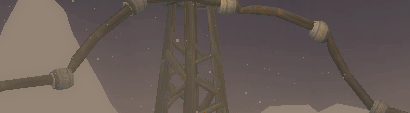
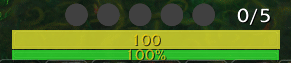
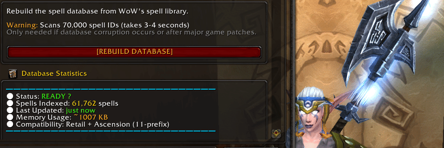

# 🔊 SoundAlerter - Complete PvP Combat Suite

   

<strong>From Simple Alerts to Complete Combat Mastery</strong> 
What started as voice callouts has evolved into a comprehensive PvP combat suite for WoW Ascension

---

## 🎯 What Makes SoundAlerter Different

**SoundAlerter is no longer an alert addon** - it's now a **complete combat system** built from the ground up for competitive PvP. Eight integrated modules work together to give you millisecond-perfect awareness of everything happening in combat.

**Performance First**: Sub-millisecond alert latency, <500KB memory footprint, zero game freezes. Every module is optimized to the brim.

**Built for Ascension**: Native support for both retail and 11-prefixed spell IDs. Seamless compatibility with WoW Ascension's unique spell system.

---

## 🚀 The Complete Suite

### 🎙️ Voice Alerts - Instant Audio Callouts
The foundation that started it all. **450+ critical spell callouts** with crisp, professional voice alerts.

[In case you need to extend, use https://luvvoice.com/ English (United Kingdom) / Sonia with Rate 10% speed-up]

**What You Get:**
- Defensive cooldown tracking (Ice Block, Shield Wall, Divine Shield)
- CC alerts (Cyclone, Polymorph, Fear, Stuns)
- Interrupt notifications (Kick, Counterspell, Mind Freeze)
- Enemy and friendly spell differentiation
- Dual language support (English/Spanish voice packs)

**Configuration**: `/sa` → Voice Alerts tab

---

### 🎯 Proximity Alerts - Gank or Be Ganked

**Visual and audio alerts when enemies enter range.** Sticky toasts with instant targeting, countdown timers, and click-to-target functionality.

**Features:**
- Automatic enemy detection with configurable range
- Persistent sticky toasts that stay until enemy leaves range
- One-click targeting directly from toast
- PvE mode filtering (hide neutral mobs in world zones)
- Performance: <1ms targeting latency

**Configuration**: `/sa` → Proximity Alerts tab
**Commands**: `/satoast test` to preview, `/satoast status` for metrics

---

### 🏴 Battleground Alerts - Never Miss a Flag Event

**Team-aware CTF tracking for WSG and Eye of the Storm.** Instant alerts when flags are picked up, captured, or dropped.

**Smart Features:**
- Automatic team detection (mixed-faction BG support)
- Class identification from combat log (no API taints)
- Visual flag status indicators
- Persistent class caching (60s + disk-saved)
- P99 processing: <10ms per event

**Configuration**: `/sa` → Battleground Alerts tab
**Commands**: `/saflag myteam` to check team assignment, `/saflag metrics` for performance stats

---

### 📊 Resource Bars - Unified Resource Tracking

**Clean, customizable bars for all power types.** Health, Mana, Energy, Rage, Combo Points - all in one unified system.

**Highlights:**
- Feral Druid support (Cat/Bear form switching)
- Smooth animations and color transitions
- Zero-taint implementation (no protected action blocking)
- Position memory per profile
- Toggleable individual bars

**Configuration**: `/sa` → Resource Bars tab

---

### ⏱️ Casting Bars - Know What's Coming

**Professional cast bars for Player, Target, and Focus.** Clean design with spell icons and interrupt visualization.

**Features:**
- Smooth cast progress with millisecond accuracy
- Channeled spell support
- Interrupt flash effects
- Independent toggle for each unit (Player/Target/Focus)
- Minimal memory footprint

**Configuration**: `/sa` → Casting Bars tab

---

### 🎯 Spell Tracker - Never Lose Track of Cooldowns

**Icon-based tracking system for buffs, debuffs, and cooldowns.** Fully customizable with duration timers and visual alerts.

**Power Features:**
- Track player and target auras simultaneously
- Cooldown spiral animations
- Duration countdown overlays
- Configurable icon size and positioning
- Filter by spell importance

**Configuration**: `/sa` → Spell Tracker tab

---

### 🔍 Spell Finder - Developer's Swiss Army Knife

**Search 12,000+ spells instantly.** Built for developers and power users who need spell IDs and tooltip data.

**Developer Tools:**
- Real-time search with <1ms response
- Full tooltip rendering with spell details
- Dual spell ID support (retail + 11-prefixed)
- Non-blocking database build (no freezes)
- Export spell data for custom configurations

**Configuration**: `/sa` → Developer Tools tab

---

### 📈 Statistics - Combat Intelligence

**Detailed encounter statistics with danger ratings.** Track alerts fired, enemy encounters, and combat patterns.

**Analytics:**
- Per-encounter statistics
- Alert frequency tracking
- Enemy danger ratings
- Session summaries
- Clean bar-based visualization

**Access**: Integrated into main options panel

---

## 🎮 Getting Started

### Installation (30 Seconds)

1. **Download** the latest release from GitHub
2. **Extract** `SoundAlerter` folder to `World of Warcraft/Interface/AddOns/`
3. **Launch WoW** and look for the minimap button

### Quick Setup (2 Minutes)

1. Type `/sa` or click the minimap button
2. Navigate to **Quick Start** tab
3. Select your combat zones (Arena, BGs, World PvP)
4. Choose alert scope (enemies only / all players)
5. Test audio with the preview button

**You're ready.** Enter any battleground and experience instant awareness.

---

## ⚡ Performance Metrics

| Metric | Value | Technical Details |
|--------|-------|-------------------|
| **Alert Latency** | <1ms | Optimized combat log parsing with direct handler dispatch |
| **Memory Footprint** | ~485 KB | String interning, efficient data structures, LRU caching |
| **Toast Targeting** | <1ms | Pre-built unit scan lists with cached combat state |
| **Flag Processing** | P99 <10ms | Event-driven with persistent class cache |
| **Spell Search** | <1ms | Multi-level indexing on 12,000+ spell database |
| **Database Load** | 2s (cached) | Initial build ~3.5s with non-blocking chunk processing |

**Translation**: Every module is built for competitive PvP where milliseconds matter. No lag, no freezes, no compromises.

---

## 🎮 Command Reference

| Command | What It Does |
|---------|--------------|
| `/sa` | Open main options panel |
| `/satoast test` | Show test proximity alert |
| `/satoast status` | Display proximity performance metrics |
| `/saflag myteam` | Show current BG team assignment |
| `/saflag metrics` | Display flag alert performance stats |
| `/saflag cache` | Show class cache size and efficiency |
| `/sa stats` | Show class detection statistics |

---

## 🛠️ Technical Highlights

**Built on Ace3 Framework**: Professional addon architecture with AceAddon, AceEvent, AceDB, AceConfig, AceGUI.

**Zero-Taint Design**: All UI operations use secure APIs. No protected action blocking in combat.

**Ascension-Native**: Automatic detection and handling of both retail (51514) and 11-prefixed (1151514) spell IDs.

**Event-Driven Architecture**: Hooks `COMBAT_LOG_EVENT_UNFILTERED` for maximum performance and reliability.

**Profile System**: Full per-character configuration with import/export via AceDB-3.0.

---

## 🤝 Credits & Inspiration

**Original Authors**: Trolololol, Abatorlos of Spinebreaker, Duskashes, Superk
**Ascension Development**: th3pajay

**Inspired By:**
- [LootCollector](https://github.com/mmobrain/LootCollector/tree/main) - Performance optimization techniques
- [Spy-Bronzebeard](https://github.com/MCribari/Spy-Bronzebeard) - Proximity detection patterns

---

## 📜 License

MIT License - Free to use, modify, and distribute.

---

## 🌊 Fair Winds

*Built with ❤️ for the Ascension PvP community*

**th3pajay / Starmistx** - An old feral
[Warcraft Movies Archive](https://warcraftmovies.com/pv.php?t=3&l=pajay)

---

<strong>Download • Configure • Dominate</strong> 
<em>The last addon you'll need for competitive PvP</em>

